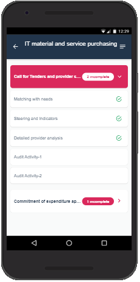
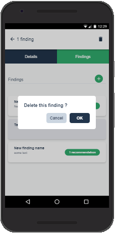
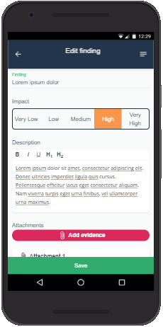
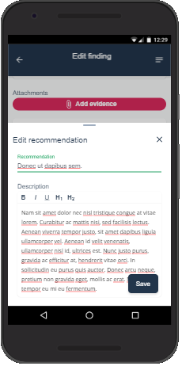

# Audit Everywhere

**Audit Everywhere** is the mobile component of **HOPEX Internal Audit**. It allows auditors to carry out an audit on site, using any device, regardless the internet connection. Data is seamlessly synchronized with HOPEX as soon as an Internet connection is available.

Watch video which presents the solution Audit Everywhere.

Using Audit Everywhere it is possible to:

- Consult the audit work program and the activities assigned to the user
- Create findings and recommendations
- Attach evidence

## Installation procedure
- [Install and configure from **app-idcard.zip**](docs/deployment.md)
- [Configure build and deploy](docs/configure-build-deploy.md)

## Documentation
- [Application ID Card quick start guide](docs/readme.md)

## Licence
- [Licence](LICENSE)

