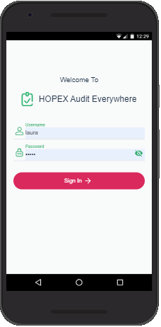

# Audit Everywhere

**Audit Everywhere** is the mobile component of **HOPEX Internal Audit**. It enables auditors to work without a network connection to HOPEX.
To work offline, you need to install **Audit Everywhere** on your mobile device or laptop. Then get all your assigned activities on the mobile device or laptop when network connection is still available.**Audit Everywhere** synchronizes data with **HOPEX Internal Audit** as so on as the network connection becomes available.

- [Install and configure from **Audit-everywhere.zip**](docs/deployment.md)
- [Configure build and deploy](docs/configure-build-deploy.md)
- [Audit Everywhere quick start guide](docs/readme.md)
- [Licence](LICENSE)

Watch video which presents the solution Audit Everywhere.

