# Audit Everywhere Quick Start Guide

**Audit Everywhere** is the mobile component of **HOPEX Internal Audit**. It enables auditors to work without a network connection to HOPEX.

>:warning: Important
>
>To work offline, you need to:
>
> - [Install Audit Everywhere](#install-audit-everywhere) on your mobile device or laptop.
> - Get all your assigned activities on the mobile device or laptop when network connection is still available.
> - Sign In when connection is available
>
> **Audit Everywhere** synchronizes data every minute with **HOPEX Internal Audit** as soon as the network connection is available.
>
> After working offline with **Audit Everywhere**, you need to complete your activities in **HOPEX Internal Audit** to complete activity workflows.
>

---

## Sign In

After the [installation of Audit Everywhere](#install-audit-everywhere), open **Audit Everywhere** App or, with Google Chrome (for instance), browse to the **Audit Everywhere** URL. The following login page opens.

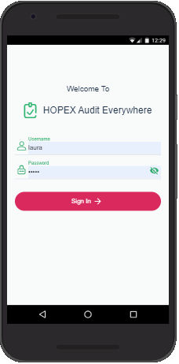

Enter your **Username** and **Password** (the same as when in **HOPEX Internal Audit**)
then tap  **Sign In**. The [All Audits](#all-audits) page opens.

> Please note that you need to be online with your HOPEX network to Sign In into the application.

## All Audits

**Audit Everywhere** displays the list of audits in which you have some activities to perform.
It shows the name of the audit, its time frame and the number of completed activities among all existing activities. On the top of the application **Offline** appears when the connection is to slow or disabled.
Tap one of the audits to view the [Audit Details](#audit-details).

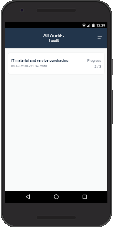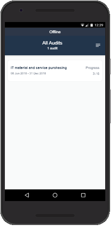

---

## Menu

Tap on the **menu icon** on the top right conner makes appear the menu pan. It shows information about the sign in user, application version and the connection status: Online or Offline.
On this menu pan you can:

- Return on the [All Audits](#all-audits) page from every page of the application.
- **Sign Out** and return to the [Sign In](#sign-in) page.

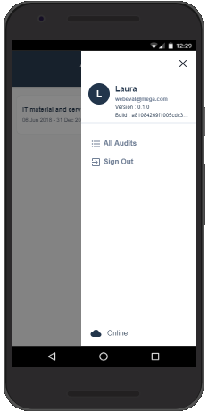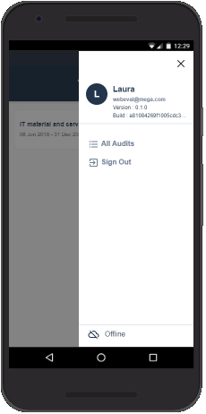

---

## Audit Details

**Audit Everywhere** displays a list of themes under the name of the audit. A theme is a grouping of activities. Activities that are not part of a theme are displayed under **No Theme**.

Each **Theme** displays the number of incomplete activities. Completed activities are followed by a check mark. Tap an activity to display the [**Activity page**](#activity-page).

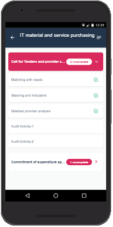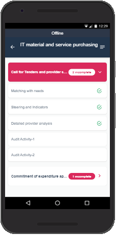

---

## Activity page

The activity page consists of two tabs under the name of the activity:

- The [activity Details](#details-tab)
- The list of the activity [Findings](#findings-tab).

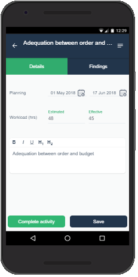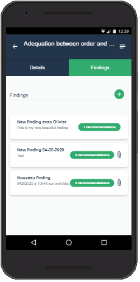

### Details tab

The Details tab displays the activity start and end date. You can fill in the amount of time spent on the activity. It also displays the description of the activity.

>:bulb: Tip
>
>The **Complete activity** button changes only the local status of the activity. This is the only information which is not synchronized with **HOPEX internal Audit**. The auditor has to complete all its activities in **HOPEX Internal Audit**. The completed activities are not updatable in the application.
>

### Findings tab

It displays the list of exiting findings with their name, part of their description and the number of associated recommendations. From this tab you can:

- [add a new finding](#create-a-finding),
- [edit an existing finding](#edit-a-finding),
- [delete one or more findings.](#delete-a-finding)

#### Create a finding

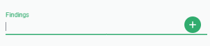

In the Findings tab, enter the finding name then tap the **plus (+)** sign. The [finding page](#finding-page) with the name entered appears.
Alternatively, tap the **plus (+)** sign directly.

#### Edit a finding

Tap a finding to display the [finding page](#finding-page).

#### Delete a finding

Press and hold one or several findings on your mobile device, or select checkboxes on a laptop.

- Tap the **arrow** to cancel the action.
- Tap the **trash bin** to delete the selected finding.

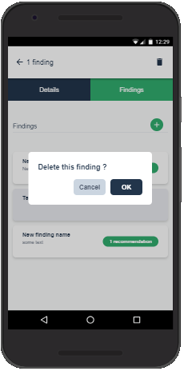

---

## Finding page

The Finding page enables you to edit the finding details:

- Name (mandatory)
- Impact of the finding (Very Low, Low, Medium, High,Very High)
- Description of the finding

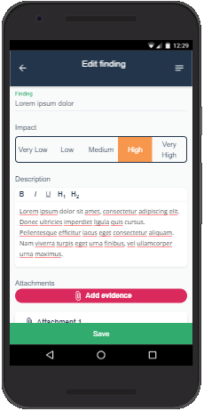

It displays the evidence. From this list you can:

- [add a new piece of evidence](#creating-evidence),
- [view an existing piece of evidence](#viewing-evidence),
- [delete one or more pieces of evidence](#deleting-evidence).

It displays the list of recommendations you can make on the finding, with their name and part of their description. From this list you can:

- [create a recommendation](#creating-a-recommendation),
- [edit an existing recommendation](#editing-a-recommendation),
- [delete one or more recommendations](#deleting-recommendations).

Tap the **Save** button to store/synchronize your modifications.

---

## Evidence

### Creating evidence

 On top of the list of attachments, tap the **Add evidence** button. its make appears according to your device the possibility to:

- use the Camera of the device to take a photo.
- use the Camcorder of the device to take a video.
- use the Recorder of the device to capture an audio stream.
- browse for any file of the device.
- The evidence is uploaded when the arrow in the cloud become a check mark.

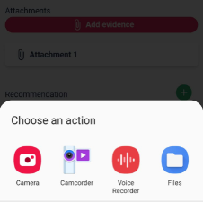

>:bulb: Tip
>
>To allow the use of Camera, Camcorder, Recorder and  browse for any file.
>Check the **APP Permission** of your browser in your device:
>
> - Camera,
> - Microphone,
> - Storage.
>

### Viewing evidence

Tap an evidence to download it. It works Online only.

### Deleting evidence

Press and hold one or several evidences on your mobile device, or select checkboxes on a laptop. The trash bin bar appears.

- Tap the **arrow** to cancel the action.
- Tap the **Trash bin** to delete the selected evidence.

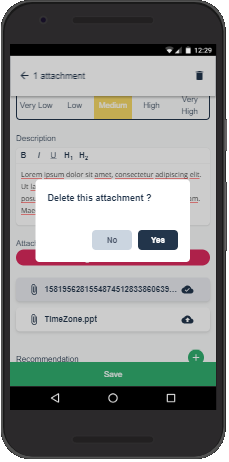

---

## Recommendations

### Creating a recommendation

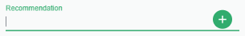

On top of the list of recommendations, enter the name of the new recommendation then tap the **plus (+)** sign, or directly tap the **plus (+)** sign. The recommendation popup [recommendation popup](#recommendation-popup) appears with the name entered.

> :warning: Important
>
> you must save the findings to store/synchronize your new recommendation.

### Editing a recommendation

Tap a recommendation to open the [recommendation popup](#recommendation-popup)

### Deleting recommendations

Press and hold one or several recommendations on your mobile device, or select checkboxes on a laptop. The trash bin bar appears.

- Tap the **arrow** to cancel the action.
- Tap the **Trash bin** to delete the selected recommendation.

### Recommendation popup

The **recommendation popup** enables you to enter/modify the name, which is mandatory, as well as the description of the recommendation.

- Tap the **Save** button to save modifications and close the popup window.
- Tap the **X** at the top right angle to close the popup window. This cancels all modifications

>:warning: Important
>
> you must save the findings to store/synchronize your modifications on recommendation.

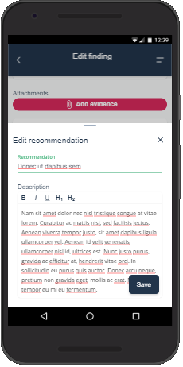

---

## Install Audit Everywhere

[Installation compatibility chart](https://caniuse.com/#feat=serviceworkers)

### Safari on IOS

To put **Audit everywhere** shortcut on your Home screen, do the following:

1. Browse to **Audit everywhere**  URL  in Safari
1. Tap the **Share button** in Safari for Audit everywhere.
1. Tap the icon labeled **Add to Home Screen**.
1. Tap Add in the upper-right corner.
1. Now name Audit everywhere so that it's distinguishable from its native counterpart on the Home screen and in Search
1. Tap Add in the upper-right corner.

### Samsung Internet

1. Browse to **Audit everywhere** URL in Samsung Internet
1. Then :
   - On the the address bar
      - Tap on the **download sign** 
   - Or on the Samsung Internet menu
     1. Tap on **+ Add page to**
     1. Select **Apps Screen** on the popup window
  
1. Confirm your choice in the popup window by selecting **Install**

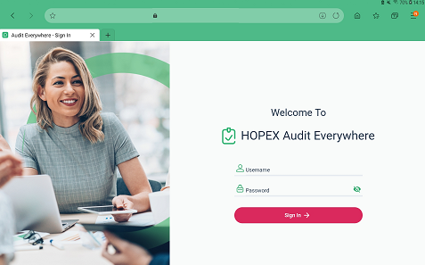

### Chrome on Android

1. Browse to **Audit everywhere** URL in chrome.
1. Then:

   - Tap on the message
     - **Add Audit Everywhere to to Home screen**
   - or select in chrome menu
     - **Add to to Home screen** in chrome menu
1. Confirm your choice in the popup window by selecting **Add**.  

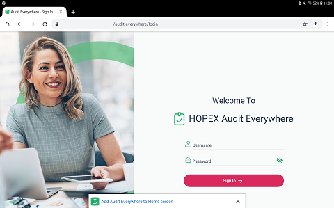

---

## Reset cache

### Reset cache in chrome

1. Select **Settings** in chrome menu.
1. Under Select **Site Settings** under advanced section.
1. Select Storage
1. Select the storage corresponding to audit everywhere web site.
1. Tap on **Clear & Reset**

### Reset cache in Samsung Internet

1. Select **Settings** in the menu.
1. Tap on **Sites and Download**
1. Tap on **Manage website data**
1. Tap on **Delete**
