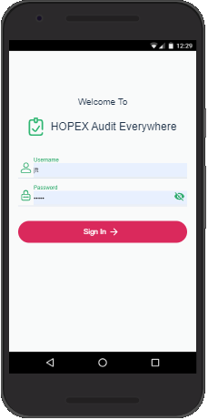
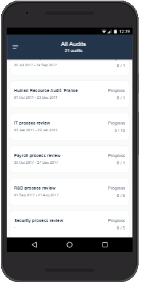
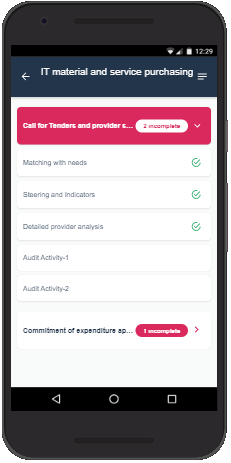
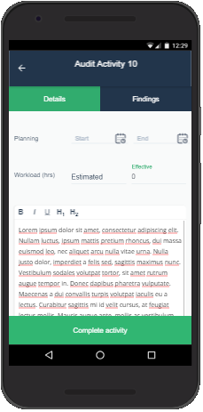
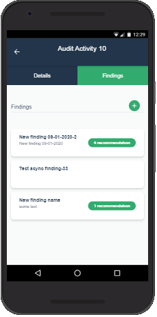
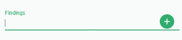
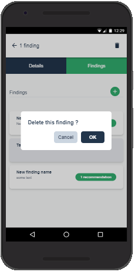
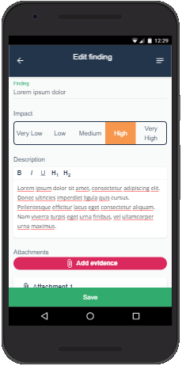
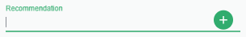
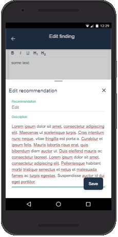

# Audit Everywhere Quick Start Guide

**Audit Everywhere** is the mobile component of **HOPEX Internal Audit**. It enables auditors to work without a network connection to HOPEX.

>[!IMPORTANT]
>To work offline, you need to:
>
> - install **Audit Everywhere** on your mobile device or laptop.
> - get all your assigned activities on the mobile device or laptop when network connection is still available.
>
>**Audit Everywhere** synchronizes data with **HOPEX Internal Audit** as soon as the network connection becomes available.
>
>After working offline, you need to complete your activities in **HOPEX Internal Audit** to complete activity workflows.
>

## Login

With Google Chrome (for instance), browse to the **Audit Everywhere** URL. The following login page opens.
The first time you log in, Chrome offers you to install **Audit Everywhere** on your device.

Enter your **Username** and **Password** just like in **HOPEX Internal Audit**.
then tap  **Sign In**. The [**All Audits**](#all-audits) page opens.

## All Audits

**Audit Everywhere** displays the list of audits in which you have some activities to perform.
It shows the name of the audit, its timeframe and the number of completed activities among all existing activities.
Tap one of the audits to view the [**Audit Details**](#audit-details).

## Audit Details

**Audit Everywhere** displays a list of themes under the name of the audit. A theme is a grouping of activities. Activities that are not part of a theme are displayed under **No Theme**.

Each **Theme** displays the number of incomplete activities. Completed activities are followed by a check mark.
Tap an activity to display the [**Activity page**](#activity-page).

## Activity page

The activity page consists of two tabs under the name of the activity. It shows the [activity Details](#details-tab) and the list of [Findings](#findings-tab) of the activity.

### Details tab

The Details tab displays the activity start and end date. You can fill in the amount of time spent on the activity. It also displays the description of the activity.

> [!IMPORTANT]
>The **Complete activity** button changes only the local status of the activity. This is the only information which is not synchronized with **HOPEX internal Audit**.
>
>The auditor has to complete all its activities in **HOPEX Internal Audit**.

### Findings tab

It displays the list of exiting findings with their name, part of their description and the number of associated recommendations. From this tab you can:

- [add a new finding](#create-a-new-finding),
- [edit an existing finding](#edit-finding),
- [delete one or more findings.](#delete-finding)

### Creating a finding

In the Findings tab, enter the finding name then tap the **plus (+)** sign. The [**Finding page**](#finding-page) with the name entered appears.
Alternatively, tap the **plus (+)** sign directly.

#### Editing a finding

Tap a finding to display the [**Finding**](#finding) page.

#### Deleting a finding

Press and hold one or several findings on your mobile device, or select checkboxes on a laptop. Tap the **trash bin** to delete the selected finding and confirm.

## Finding page

The Finding page enables you to edit the finding details:

- name (mandatory)
- impact of the finding
- description of the finding

It displays the evidence. From this list you can:

- [add a new piece of evidence](#creating-evidence),
- [view an existing piece of evidence](#viewing-evidence),
- [delete one or more pieces of evidence](#deleting-evidence).

It displays the list of recommendations you can make on the finding, with their name and part of their description. From this list you can:

- [create a recommendation](#creating-a-recommendation),
- [edit an existing recommendation](#editing-a-recommendation),
- [delete one or more recommendations](#deleting-recommendations).

Tap the **Save** button to store/synchronize your modifications.

### Recommendations

#### Creating a recommendation

On top of the list of recommendations, enter the name of the new recommendation then tap the **plus (+)** sign, or directly tap the **plus (+)** sign. The recommendation popup [**recommendation popup**](#recommendation-popup) appears with the name entered.

#### Editing a recommendation

Tap a recommendation to open the [**recommendation popup**](#recommendation-popup)

#### Deleting recommendations

Press and hold one or several recommendations on your mobile device, or select checkboxes on a laptop. The trash bin bar appears. Tap the **Trash bin** to delete the selected recommendation.

### Recommendation popup

The **recommendation popup** enables you to enter the name, which is mandatory, as well as the details of the recommendation.

- Tap the **Save** button to store/synchronize your modifications and close the popup window.
- Tap the **X** to close the popup window. This cancels all modifications

### Evidence

#### Creating evidence

#### Viewing evidence

#### Deleting evidence
